# A股量化研究平台总执行计划

状态：唯一有效的执行顺序文档，自 2026-07-18 起生效。

## 1. 文档定位与优先级

本文件负责回答整个项目“最终要建成什么、按什么顺序完成、何时可以进入下一阶段”。以后不再由临时对话、单次实验报告或旧计划决定下一步。

权威关系如下：

1. 用户最新明确指令；
2. `registry/` 中的正式基线、候选和晋级规则；
3. `RESEARCH_PROTOCOL.md` 的研究边界与时间协议；
4. `PROJECT_RULES.md` 的工程治理；
5. 本总计划的执行顺序与阶段状态；
6. ADR、架构文档和专项设计；
7. 旧路线图、旧 Qlib 计划和历史报告仅作背景证据。

`LONG_TERM_QUANT_PLATFORM_ROADMAP_20260717.md` 和 `QLIB_ADOPTION_PLAN_20260712.md` 继续保留技术细节，但不再单独决定执行顺序。所有实际进度只在本文件和对应阶段的 `.planning/` 记录中更新。

## 2. 最终目标

建设一套适合 50 万至 100 万人民币账户的、可复现且可审计的 A 股主动量化研究与人工 Shadow 系统：

- 使用严格 PIT 数据训练横截面 Alpha 模型；
- 将模型分数、组合构建、订单生成和真实执行完全分层；
- 使用 realistic open-price share-ledger 模拟现金、股数、整手、费用、ADV、停牌、涨跌停、新股和 ST 等约束；
- 只用 2024 Val 与 2025 Test 做研究选择，2026 全年只作 Forward 观察；
- 通过月度滚动 OOF 检查跨市场状态稳定性，并研究月度重训能否提升收益；
- 在不明显牺牲收益的前提下，提高 Sharpe、控制回撤、换手、成本和容量；
- 最终进入人工批准、可暂停、可回滚的 Shadow，而不是自动实盘。

目标不是“复刻 Qlib”，而是借鉴 Qlib 的工业化研究流程，同时保留本项目更适合 A 股的 PIT 数据和 `open_ledger` 执行层。

## 3. 不可改变的研究契约

1. `val_2024`：2024-01-01 至 2024-12-31，可参与选择。
2. `test_2025`：2025-01-01 至 2025-12-31，可参与最终研究确认。
3. `forward_2026`：2026-01-01 至最新完整交易日，只观察，不能调参、选模型或选组合规则。
4. `2026-05-18` 仅是旧缓存或旧报告日期，不是 Forward 起点。
5. 正式选择必须同时检查 Val 和 Test，不允许只凭单个区间晋级。
6. 正式资本固定覆盖 50 万和 100 万。
7. 正式压力场景固定覆盖 `normal`、`lag1`、`cost2x`、`capacity_3pct`。
8. 正式成交器只有 realistic open-price share-ledger；Qlib Executor 不替代它。
9. Alpha IC/Rank IC 是诊断指标，不是最终 checkpoint 或模型晋级标准。
10. V9 因历史测试期污染不进入正式候选；`avgw3` 只保留为 V9 专项历史参考，不默认用于新模型。
11. `maxret095` 是信号日追高/可买性规则研究项，不得被包装成模型 Alpha 提升。
12. 不自动晋级、不自动交易，生命周期切换必须人工批准。

## 4. 总体架构

```mermaid
flowchart LR
  A["PIT 数据与统一 Provider"] --> B["Dataset / Processor / 时间切分"]
  B --> C["Model Adapter / 训练与预测"]
  C --> D["带 lineage 的 dated score"]
  D --> E["Rolling OOF / Ensemble"]
  E --> F["Strategy / Portfolio Constructor"]
  F --> G["Order Proposal"]
  G --> H["Realistic Open Ledger"]
  H --> I["Records / 归因 / Registry Gate"]
  I --> J["Prepared / 人工 Shadow / 回滚"]
```



每一层只承担自己的职责。模型只产生分数；组合层决定目标持仓；执行层决定能否成交；Registry 决定研究候选是否晋级。

## 5. 当前真实位置

截至 2026-07-18：

- 已完成：研究边界统一、正式 Registry、Workflow v2、实验 manifest/events/artifact hash、PredictionFrame、六类 Records、realistic `open_ledger`、生命周期状态机、首个冻结基线正式链路验收。
- 已完成但仍需收敛：Dataset/DataHandler/Processor 接口、LightGBM/PyTorch Model Adapter、Rolling/OOF 框架、TopK/dropout 和组合优化原型。
- 已完成 P2A：正式 LightGBM Dataset 在 2024 与 2025 两个窗口均达到样本、best iteration、模型和 Alpha 字节一致；因新路径没有稳定性能优势，默认仍为 `legacy_iter`，统一 Dataset 保留为已验证入口。
- 已完成 P2B：正式 LightGBM trainer 已在 2024/2025 两个窗口通过 Model Adapter，模型和 Alpha 均字节一致；旧 trainer 只保留为兼容默认与 parity oracle。
- 已完成 P2C 工程门：`multi_downside_e19` 的强模型 Dataset 字段与旧 `PrecomputedMemmapDataset` 逐字段一致；真实 trainer 已通过 `TorchStrongAlphaAdapter` 委托运行；同 checkpoint 单窗口推理及三个跨状态窗口重放均达到 Alpha 文件字节一致。
- 已完成 P3 第一版工程门：真实 Adapter replay 已生成并校验 environment/source/data/feature-transform/command/runtime 六类 provenance，实际参与源码按内容哈希，artifact index 强制登记完整 bundle。
- 尚未完成：P4 强模型完整 Rolling、统一组合构建正式实验、完整 Shadow 日运行。
- 外部数据缺口：历史 ST 状态源不完整；该事项不阻塞框架主线，但会阻塞“历史 ST 约束完全真实”的最高等级声明。

项目当前处于 **P4 强模型 Rolling 暂停与契约硬化**：Compact 完整 OOF、强模型
Adapter、单窗恢复演练和 P3 provenance 均已验收；24 窗强模型运行在
`oos_2024_02/base_e6/epoch_005` 后按用户要求暂停。恢复前先完成训练阶段语义、
profile 证据等级、checkpoint 选择口径和滚动频率的复核。目前仍不是重新调收益参数。

## 6. 总执行阶段

| 阶段 | 目标 | 当前状态 | 进入条件 | 完成门槛 |
|---|---|---|---|---|
| P0 | 协议、Registry、规则和执行基线冻结 | 已完成 | 无 | 单一日期协议、正式基线和执行口径可校验 |
| P1 | Qlib 式 Workflow/Recorder/Dataset/Adapter 骨架 | 已完成工程骨架 | P0 | 接口、manifest、Records、恢复机制有测试 |
| P2 | 正式训练主线收敛 | 已完成工程门 | P1 | LGBM 与强模型均走统一 Dataset/Adapter，保留回退且结果等价 |
| P3 | 完整可复现与运行治理 | 已完成第一版 | P2 可并行后半段 | 环境、源码、数据、变换、命令和产物均可追溯 |
| P4 | Rolling/OOF 与动态重训研究 | 暂停，先硬化契约 | P2、P3 | 唯一 OOS 信号拼接，无跨界、可恢复、统一 ledger |
| P5 | 模型与标签的受控研究 | 待完成 | P4 首个基线 | 预注册消融，Val/Test 组合表现优于固定基线 |
| P6 | 状态感知组合构建 | 待完成 | P4 有可信 OOF | 风险/成本/换手约束产生可归因净增益 |
| P7 | 正式候选晋级与冻结 | 待完成 | P5/P6 至少一项通过 | 16-cell 证据、归因、容量和 Registry gate 全通过 |
| P8 | 人工 Shadow | 框架已验收，运行待批准 | P7 | 日运行稳定、漂移可见、暂停和回滚演练通过 |
| P9 | 长期在线更新与扩展 | 暂不启动 | P8 稳定期完成 | 月度复核后另立 ADR 和风险预算 |

### P0：治理与基线冻结

该阶段已经完成，后续只维护，不重新设计。

固定内容：

- 正式组合基线：`ledger_path_v3_t0001_nolookahead`；
- 主要模型资产：保留 `multi_downside_e19`、e22-e25 等当前证据和缓存；
- 正式 split、资本、压力场景、报告日期字段和晋级规则；
- 清理与归档必须有清单，不能删除 Registry、正式 alpha、checkpoint、数据和可重放证据。

回归条件：若任何代码变更破坏 split、执行口径或 artifact hash，立即退回 P0 修复，停止收益实验。

### P1：Qlib 式研究框架骨架

已完成的能力：

- 声明式 Workflow v2 和阶段图；
- experiment manifest、append-only events、artifact index/hash；
- Dataset/DataHandler/Processor 接口和 train-fit/frozen-infer 变换；
- Model Adapter 和统一 PredictionFrame 契约；
- Signal、诊断、ledger、position、attribution、decision Records；
- prepared/shadow/paused/retired 生命周期与人工批准。

仍需在 P2/P3 用真实训练主线完成生产级验收。不能再笼统宣称“已完全对齐 Qlib”。

### P2：正式训练主线收敛

#### P2A LightGBM Dataset 主线

1. 保留 2024 已完成的字节一致性证据。
2. 补 2025 单窗口 `legacy_iter` 与 `project_dataset` 一致性。
3. 定位并优化新 Dataset 约 11.6% 的包装开销，不复制第二份大缓存。
4. 只有同时满足结果一致、内存适合 16 GB、性能无明显退化，才把默认切为 `project_dataset`。
5. 未通过则继续使用 `legacy_iter`，新 Dataset 保留为实验入口，不阻塞后续研究。

#### P2B LightGBM Model Adapter 主线

1. 将 adapter 的日级 quota、随机种子、purge 和标签 mask 与正式 trainer 对齐。
2. 对同一窗口比较 sample IDs、模型 hash、dated score 和 stitched alpha。
3. 让 runner 委托 adapter 执行 fit/predict，而不是并存两套核心训练逻辑。
4. `legacy_iter`/旧 trainer 保留为只读 parity oracle 和紧急回退。

#### P2C `multi_downside_e19` 强模型主线

1. 冻结已重建训练配置、标签、loss、seed、batch、checkpoint 选择规则和缓存版本。
2. 先做三个跨市场状态的小窗口 staged pilot，验证 resume、purge、Dataset、Adapter 和 PredictionFrame。
3. 内部 `rawtopstable` 只允许保存可恢复的工程 pilot checkpoint，不构成模型晋级；不得用三个孤立 pilot 月份替代完整选择证据。
4. 正式 checkpoint/profile 选择放在 P4：完整 2024/2025 OOF 信号生成后，使用同一 realistic ledger、资本和压力场景决定；不再只看 IC 或内部训练指标。
5. pilot 工程门通过后才允许进入 P4 的完整月度 Rolling。

P2 验收门：两个模型家族都可由同一 Workflow 声明、同一 Dataset 契约、同一 PredictionFrame 和同一实验记录体系运行；旧路径可回退，但不再承担新增功能。

### P3：完整可复现与运行治理

必须补齐：

- `environment_manifest`：Python、Torch、CUDA、LightGBM、依赖锁和硬件；
- `source_manifest`：Git commit；dirty worktree 时记录实际参与运行文件的内容 hash；
- `data_manifest`：物理数据范围、逻辑 view、股票池、PIT 状态、缺失和覆盖率；
- `feature_transform_manifest`：特征版本、训练截止日、填充、截尾、标准化状态 hash；
- `command_manifest`：完整可重放命令和 resolved config；
- `runtime_metrics`：耗时、峰值内存、GPU/CPU、缓存命中和失败恢复；
- 所有排行榜只接受 terminal complete、artifact hash 完整且日期字段齐全的实验。

完成标准：在同一代码和数据快照下，另一进程可以由 manifest 重放并得到一致产物；dirty source 不再只靠一个 Git commit 冒充可复现。

### P4：月度 Rolling/OOF 与动态重训研究

详细实施、资源预算、准入门、恢复方案和交付物见：
`P4_STRONG_MONTHLY_ROLLING_EXECUTION_PLAN_20260718.md`。

首个已冻结实验协议：4 年 Train、6 个月 Valid、1 个月 OOS，每月滚动，按标签
horizon 做 purge/embargo。该协议是项目的首个研究臂，不是 Qlib 默认规则，也不预设
它就是未来生产重训频率。

恢复 24 窗强模型训练前增加一次不可跳过的 P4-R 契约硬化门：

1. 将 e6/e15 现存原始命令升级为 confirmed provenance；e16-e19 继续明确标记为由
   checkpoint、逐项 loss 日志和父命令重建，不能写成原始命令已找回。
2. 纠正阶段语义：`base_e6` 实际从 epoch 1 即包含 `OO-lag1=0.25`；
   `lag1_low_lr_e15` 只降低学习率继续同一目标，并未新增 lag1 loss。历史目录名保留，
   新 manifest 必须增加准确的 canonical stage 名称。
3. 复核 `rawtopstable_h5_top0p6` 与下一月 OOS 不一致的问题。它只可用于内部候选
   checkpoint，不得被解释为可执行组合选择标准。
4. 区分“完成当前 4y/6m/1m 审计臂”和“选择生产更新频率”。后者必须在低成本、
   预注册的 1/3/6 月频率比较后单独决定，不能因为 Qlib 支持 rolling 就默认月更。
5. 当前已产生的 partial 运行保持不可变；若契约改变，创建新 experiment ID，不覆盖、
   不混接旧窗口。

P4-R 已于 2026-07-18 完成：profile v2、canonical stage、57-checkpoint 只读跨月诊断和
1/3/6 月统一窗口契约均已落地。诊断未发现 `rawtopstable`、`rawtopret` 或验证 Alpha
对下一月 OOS 具有跨三个 pilot 月一致方向，因此不发明新综合分，也不立即恢复月度强模型。
详细结论见 `reports/p4r_contract_hardening_20260718/P4R_CONTRACT_HARDENING_RESULT_ZH.md`。

执行顺序：

1. 先用 Compact LightGBM 跑完整 2024 Val + 2025 Test 月度 OOS，作为低成本工程基线。
2. 每个 OOS 日期只能有一个当时可用模型；预处理器只能在该窗口 Train 拟合。
3. 拼接唯一 OOS alpha 后，运行一条连续 realistic open-ledger，不把各月收益简单相加。
4. 通过完整性、覆盖、泄漏、恢复和账本测试后，再跑 `multi_downside_e19`。
5. 比较静态冻结模型与月度重训模型，判断“更新更及时”是否真带来 Val/Test 净收益。
6. Ensemble 只能使用预测日当时已经训练完成的模型，先等权/rank-average，再考虑状态条件权重。
7. 最后生成 2026 Forward 观察，禁止据此选择训练窗口或组合权重。

P4 不是一次普通回测，而是验证整个模型在多个真正 OOS 月份是否稳定，以及月度重训是否值得其计算成本。

### P5：模型、标签和 loss 的受控研究

只在 P4 基线可信后启动，避免继续碰运气调参。

固定候选族：Compact/Broad LightGBM、静态 `multi_downside_e19`、月度滚动 `multi_downside_e19`。其他模型必须先写实验假设再加入。

允许研究的明确问题：

- CC、OO、OO-lag1 标签哪一种在 open-ledger 下更稳定；
- H1 是否增加噪声，去除或调低权重是否跨 Val/Test 有效；
- global IC、多周期、downside、Top-focus 各自的单独边际贡献；
- 长短 horizon 的收益、延迟稳定性与换手之间如何权衡；
- 多模型组合是否提供独立广度，而不是重复同一风格暴露。

规则：

- 每次实验只回答一个预注册问题；
- 消融先单因子，再做少量有理论依据的组合；
- 固定数据、seed、训练预算和 ledger 合同；
- 每个 checkpoint 同步产出 IC 诊断和可执行组合指标；
- 只因 IC 上升但组合收益下降的模型不得晋级；
- 连续两轮独立确认失败即停止该方向，不通过扩大搜索救结果。

### P6：状态感知组合构建

目标不是继续扫弱市阈值，而是建立可解释的组合层：

```text
dated score
 候选股票风险/流动性/行业/动量信息
 当日组合状态与市场状态
 换手和交易成本
 风险预算
 -> 目标持仓/替换优先级
 -> open_ledger 真实成交
```

第一层必须是简单、可解释的 retention/TopK-dropout 基线；之后才是轻量 reranker 或 portfolio optimizer。

候选特征包括：行业 HHI、Top 行业权重、beta、specific vol、动量、急涨后平台、全球/港股压力、过去主动收益、turnover、new names、ADV 和预计成本。

优化目标是 Val/Test 上的可执行风险调整收益，不是股票级 IC。约束和惩罚必须通过逐笔替换归因回答“增加了什么收益、减少了什么风险、付出了多少成本”。

禁止事项：

- 不把全球压力或 active drawdown 直接当成全局硬降仓开关；
- 不回到无归因的大范围阈值扫描；
- 不用 Qlib optimizer/executor 绕过 A 股执行约束；
- 不让精排器读取执行后才知道的信息。

### P7：候选晋级与冻结

任何候选都必须同正式基线做相同口径比较，覆盖：

- 2024 Val 与 2025 Test；
- 50 万、100 万；
- normal、lag1、cost2x、capacity_3pct；
- 年化收益、Sharpe、最大回撤、换手、成本、容量、行业集中、beta、成交受阻和新开仓数；
- 分年度、分半年、分市场状态和逐笔变更归因；
- signal_start/end、backtest_start/end、数据与代码 lineage。

晋级原则：先满足完整性和无泄漏，再比较 Val/Test 平均表现、最差表现和压力稳健性。Forward 无论多好或多差都不能改变晋级结论，只能触发完整性审计或研究假设记录。

### P8：人工 Shadow

候选通过 P7 后先进入 `prepared`，由人工批准后才能进入 `shadow`。

每日产物包括：数据 as-of、模型和策略版本、信号、目标持仓、订单 proposal、基线并行结果、缺失/漂移告警、失败重试和 artifact hash。Shadow 期间不自动下单；异常时可以 `paused`，淘汰后转 `retired`，并保留完整原因与回滚记录。

进入下一阶段前至少完成：连续日运行、断点恢复、数据迟到、信号缺失、执行失败、基线回退和人工暂停演练。

### P9：长期扩展

只在 Shadow 稳定后评估：

- 自动月度重训但仍人工批准晋级；
- OnlineManager 式模型生命周期；
- MLflow 或远程实验服务；
- 更多树模型、时序模型、图关系或动态 ensemble；
- 更完整历史 ST、指数成分、行业和公司行动 PIT 数据；
- 海外、港股、商品和宏观状态因子；
- 分布式训练、自动因子探索或强化学习。

每项都必须另立 ADR、简单基线、数据可用性审计、独立 OOS 和停止规则。它们不是当前主线。

## 7. 数据运维并行线

数据线不改变 P2-P8 顺序，但持续提供可靠输入：

1. 一个物理行情事实库，按实验声明生成任意日期逻辑 view；不因 Val/Test/Forward 复制语义不同的数据。
2. 财报按真实公告/生效日进入 PIT 特征；未知公告日标记估计状态，缺失值和沿用状态显式编码。
3. 维护停牌、零成交、真实涨跌停、新股上市天数、板块规则和历史 ST 状态。
4. 历史 ST 下载在可用数据源或权限具备后恢复；当前以“已知不完整”进入 data quality report，不能静默假定完整。
5. 海外/港股数据只作为当时可得的市场状态特征，必须记录时区、交易日对齐和发布时间。

## 8. 统一门禁

| 门禁 | 检查内容 | 失败处理 |
|---|---|---|
| G0 协议门 | split、PIT、purge、Forward 不参与选择 | 停止实验，修复协议 |
| G1 一致性门 | Dataset/Adapter 迁移前后样本、模型和 alpha 一致 | 保留旧默认，定位差异 |
| G2 可复现门 | 环境、源码、数据、变换、命令、产物 hash 完整 | 不得进入排行榜 |
| G3 运行门 | 16 GB 内存、可恢复、时长可接受、无孤儿任务 | 优化或降级，不扩大实验 |
| G4 OOF 门 | 每日唯一模型、无跨界、连续 ledger、覆盖完整 | 该 Rolling 结果作废 |
| G5 研究门 | Val/Test 同合同、归因完整、压力场景通过 | 拒绝晋级，可保留研究记录 |
| G6 Shadow 门 | 人工批准、暂停/回滚/告警演练通过 | 保持 prepared 或 paused |

## 9. 停止规则与回退策略

- 新框架路径不能证明一致性时，回退 legacy oracle，不带病切换默认。
- 新 Dataset/Adapter 明显增加内存或运行时间且无治理收益时，保留接口但不切主线。
- 模型或 loss 连续两轮独立确认不稳定，停止该假设。
- 组合规则仅改善一个 split、只改善 Forward 或只在单一资本有效，不晋级。
- 任一候选无法解释收益来源、交易成本或风险暴露，不晋级。
- 数据源缺失不以猜测值静默填补；必须标记、降级或排除。
- 任何阶段发现后视、日期口径错误或信号覆盖错位，所有下游结果失效并回到最近门禁。

## 10. 明确不做

- 不再按对话临时生成互相冲突的“下一步计划”。
- 不在 P2/P3 未收敛时启动大规模新网络、loss 或阈值搜索。
- 不把 2026 Forward 当作选择依据。
- 不用单一 IC、单一年度、单一资本或单一压力场景宣布提升。
- 不默认继承 V9、avgw3、maxret095、V3 或旧防御覆盖。
- 不用 Qlib 默认 China 数据、默认标签、close 回测或 Executor 取代现有正式链路。
- 不自动从 prepared 切到 shadow，不自动实盘。
- 不为“工业级”引入暂时无收益的分布式服务、微服务或复杂基础设施。

## 11. 当前到最终的固定推进顺序

```text
P2A 2025 Dataset parity 与性能结论
-> P2B LightGBM Model Adapter 主线迁移
-> P2C multi_downside_e19 小窗口强模型验收
-> P3 完整可复现 manifest 与运行指标
-> P4 Compact 完整月度 OOF
-> P4 multi_downside_e19 完整月度 OOF
-> P5 受控模型/标签/loss 研究
-> P6 状态感知组合构建与逐笔归因
-> P7 16-cell 正式候选晋级
-> P8 人工 Shadow
-> P9 长期扩展
```

允许的并行只有：数据质量维护、文档/test 更新和不占用正式选择预算的诊断。不得并行启动多个收益方向。

## 12. 总计划完成定义

只有同时满足以下条件，才能称为本轮工业化重构完成：

1. 正式训练、预测、组合和回测均由一个声明式 Workflow 驱动；
2. LightGBM 与强模型均使用统一 Dataset、Adapter、PredictionFrame 和 Records；
3. 任一正式结果可以从冻结 manifest 重放；
4. 2024/2025 月度 OOF 覆盖完整且通过无泄漏审计；
5. 至少一个候选在固定 16-cell 合同下通过 Registry gate；
6. 2026 Forward 始终只观察；
7. 人工 Shadow 可持续运行、暂停和回滚；
8. 历史 ST 等未完成数据质量问题被明确披露，不被隐藏。

在此之前，“框架已经工业级完成”或“策略已经可实盘”都属于过度表述。

## 13. 状态维护规则

- 每完成一个子阶段，只更新本文件对应状态、证据路径、门禁结论和日期。
- 专项 `.planning/` 计划只能展开当前子阶段，不能改变总顺序。
- 改变总顺序必须说明原因、影响和回退方案，并通过 ADR 记录。
- 旧计划中新出现的正确技术细节可以并入本文件，但不得形成第二套执行顺序。
- 每次阶段汇报统一使用：当前阶段、已完成门禁、正在运行、阻塞、下一固定里程碑；不再只回答一个孤立的“下一步”。
