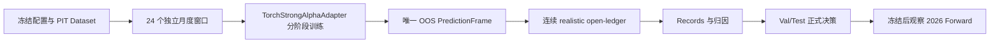

# P4 强模型月度滚动 OOF 详细执行计划书

版本：2026-07-18
所属总计划：`MASTER_QUANT_RESEARCH_EXECUTION_PLAN_20260718.md`
执行清单：`.planning/2026-07-18-p4-monthly-oof/task_plan.md`

## 1. 阶段目标

本阶段不继续碰运气调 loss、窗口或组合参数，而是回答一个明确问题：

> 在严格无后视、每月只使用当时可得数据重新训练的条件下，
> `multi_downside_e19` 月度重训能否比静态冻结模型产生更稳定、可执行的
> 2024 Val 与 2025 Test 组合收益？

P4 同时验收整条工业化研究链路：



P4 成功不等于新模型必须盈利更多。只要完整、无泄漏、可恢复地证明月度重训
有效或无效，本阶段就完成；弱结果也必须保留为正式研究结论。

## 2. 当前状态

### 2.1 已完成

- P2C：真实强模型 trainer 已能由 `TorchStrongAlphaAdapter` 委托运行。
- 同 checkpoint 的 Adapter 与旧推理路径在单窗口达到 Alpha 字节一致。
- 三个跨市场状态窗口共 63 个信号日重放达到 Alpha 字节一致。
- P3：环境、源码、数据、特征变换、命令和运行指标六类 provenance 已通过真实重放验收。
- 全量测试最近结果为 535 passed，只有一条既有 pandas FutureWarning。
- Compact LightGBM 已完成 24 窗 OOF：485 个唯一 OOS 交易日，Val 242 日、Test 243 日。
- Compact 的完整 ledger 表现未达到正式基线，保留为工程对照，不为补新元数据重复训练。
- 强模型 24 窗 dry-run 已冻结：24 窗、456 个目标 epoch、预计约 16.05 小时、约 14.96 GiB 产物。
- 磁盘门已通过：要求运行后至少保留 30 GiB 空间。

### 2.2 当前暂停点与恢复阻塞

- Adapter staged 接线、不可变单窗验收和中断恢复演练已经完成。
- 24 窗运行已经启动后按用户要求暂停；`oos_2024_01` 完成，
  `oos_2024_02/base_e6` 保存到 epoch 5，进程和 GPU 已释放。
- 现有恢复解析可从 epoch 5 继续，不重置优化器；但在完成 P4-R 契约硬化门前不得恢复。
- 当前 partial experiment 保持不可变。若训练目标、阶段语义、checkpoint 选择规则或
  滚动频率发生变化，必须创建新的 experiment ID，不能混接已有窗口。

## 3. 不可变研究契约

1. `val_2024`：2024-01-01 至 2024-12-31，可参与研究选择。
2. `test_2025`：2025-01-01 至 2025-12-31，可参与最终研究确认。
3. `forward_2026`：2026-01-01 至最新完整交易日，只观察，不参与训练、调参、checkpoint 或组合规则选择。
4. 首版滚动协议固定为 4 年 Train、6 个月 Valid、1 个月 OOS，每月滚动。
5. 标签 horizon 的 purge/embargo 必须在每个窗口独立执行。
6. 每个 OOS 日期只能有一个模型所有者，不得事后挑选表现最好的窗口。
7. 特征填充、截尾、标准化和其他可拟合处理只能使用本窗口 Train 数据。
8. 模型信号固定使用 raw 分数；不默认继承 V9 专项的 `avgw3`。
9. `maxret095` 不混入本轮模型训练结论；如测试，只能作为单独执行规则实验标注。
10. 正式执行器只有 realistic open-price share-ledger，Qlib Executor 不替代它。
11. 正式资本固定为 50 万和 100 万。
12. 正式压力场景固定为 `normal`、`lag1`、`cost2x`、`capacity_3pct`。
13. Alpha IC、Rank IC 和 `rawtopstable_h5_top0p6` 只作诊断，不直接决定正式晋级。
14. 本阶段不修改 loss、标签权重、网络、滚动长度、TopK 或 ledger 参数。

## 4. 固定训练配置

正式模型族为 `multi_downside_e19`，三个阶段严格顺序执行：

| 阶段 | 目标 epoch | 学习率 | 主要作用 | 阶段衔接 |
|---|---:|---:|---|---|
| `base_e6`（历史名） | 6 | `1e-4` | OO 综合 IC + 0.25×OO-lag1 IC | 从固定初始化开始 |
| `lag1_low_lr_e15`（历史名） | 15 | `1e-5` | 降低学习率，继续完全相同的 loss | 读取 `base_e6` exact e6，重置优化器 |
| `multi_downside_e19` | 19 | `5e-6` | 加入已冻结的多项风险相关 loss | 读取 `lag1_low_lr_e15` exact e15，重置优化器 |

其他固定项：

- 标签族：主标签 `oo`，lag1 标签 `oo_lag1`；
- horizon 索引：`0,2,4,6`；
- horizon 权重：`0.15,0.25,0.35,0.25`；
- seed：42；
- 训练 batch：4；验证 batch：2；梯度累积：4；
- 输入宽度：250；
- 每个 epoch 保存 checkpoint；
- 阶段转换只使用 exact checkpoint，禁止使用内部 best checkpoint 续训。

说明：`base_e6` 不是纯 OO baseline，`lag1_low_lr_e15` 也不是从第 7 轮才加入 lag1。
两个历史名称仅为产物兼容保留。后续 manifest 应分别记录 canonical stage：
`oo_lag1_e1_e6`、`oo_lag1_low_lr_e7_e15`、`multi_downside_e16_e19`。

内部 best checkpoint 可以保留，但不得在训练过程中决定正式模型。完整 OOF 结束后，
可从同一批训练产物生成两条信号流：

- `monthly_e19_exact`：每窗固定 epoch 19；
- `monthly_e19_selected`：每窗内部 best，仅作为待 ledger 复核的候选。

两条信号必须使用相同 OOS 日期和执行契约，正式选择只能看完整 Val/Test ledger。

## 5. 实施阶段

### P4-A：冻结输入与执行快照

工作内容：

- 校验滚动 schedule、模型 profile、缓存 meta 的 SHA256；
- 记录 Git commit；dirty worktree 时记录实际参与源码的内容 hash；
- 固定 Python、Torch、CUDA、GPU、内存和磁盘信息；
- 将 resolved config、24 个窗口边界和完整命令写入 experiment manifest；
- 将预计耗时、空间、最小剩余内存和 30 GiB 磁盘保留线写入 launch gate。

验收门：

- dry-run 不创建模型或 Alpha；
- 24 个窗口边界连续、无重叠、无缺月；
- 配置 hash 与 `launch_plan.json` 一致；
- 任一输入 hash 漂移时停止，不静默沿用旧计划。

### P4-B：将 staged runner 接入 Adapter

工作内容：

- 为三阶段训练增加统一 staged delegate；
- 每阶段通过 `TorchStrongAlphaAdapter.fit()` 调用真实 trainer；
- 保留旧 subprocess 路径为 parity oracle 和紧急回退，不再作为新增正式默认；
- 统一返回 checkpoint 路径、epoch、输入宽度、选择指标、hash 和运行指标；
- 保留现有 exact/selected 语义、阶段恢复和 artifact index；
- 失败时将事件写入 append-only events，不覆盖已完成阶段。

必须新增或补齐的测试：

- 三阶段命令解析与 resolved config 一致；
- exact e6 -> exact e15 -> exact e19 的衔接正确；
- reset optimizer 在第二、三阶段生效；
- 已存在且 hash 一致的完成阶段可跳过；
- hash 不一致、epoch 不符、输入宽度不符时硬失败；
- Adapter 与 oracle 使用同 checkpoint 推理时 Alpha 字节一致。

验收门：相关单测通过，且不改变现有 535 项测试的行为。

### P4-C：单窗口不可变验收与恢复演练

选择一个已完成 pilot 所覆盖的窗口，执行一次正式结构的 staged run：

1. 完整运行三阶段并生成 exact/selected Alpha；
2. 校验 PredictionFrame schema、日期、股票代码、score 和 lineage；
3. 在阶段边界模拟中断；
4. 使用同一输出目录恢复；
5. 确认已完成阶段不重训，未完成阶段从正确 exact checkpoint 继续；
6. 比较恢复前后 artifact hash 和最终 Alpha；
7. 校验六类 provenance 与 artifact index。

验收门：

- 同配置重放产物一致；
- 恢复后不出现重复 epoch、重复日期或覆盖旧产物；
- 单窗运行期间可持续记录进程树内存、CPU、GPU 和耗时；
- 至少保留 0.75 GiB 可用内存，触线则安全停止。

### P4-D：24 窗顺序运行

执行原则：

- 按 `oos_2024_01` 到 `oos_2025_12` 顺序运行；
- 16 GiB 内存条件下只允许单窗口串行，不并行训练多个窗口；
- 每完成一个阶段立即写 checkpoint hash、事件和 progress；
- 每完成一个窗口立即验证 Alpha 日期、覆盖率和唯一所有权；
- 运行可随时安全中断，恢复时先校验已完成产物 hash；
- 不因某个月 IC 较差而中途删除或跳过窗口；
- 不在运行中查看 2026 Forward 来决定是否继续。

自动暂停条件：

- 可用内存低于 0.75 GiB；
- 预计运行后磁盘空间低于 30 GiB；
- checkpoint、配置、源码或缓存 hash 漂移；
- OOS 日期重叠、缺失或越界；
- 连续阶段恢复失败；
- CUDA OOM 在降低非研究性资源参数后仍复现。

资源预算：

- 目标 epoch 总数：456；
- 基于三个 pilot 的 GPU 时间估计：约 16.05 小时；
- 产物估计：约 14.96 GiB；
- 不将临时训练目录写入 C 盘其他重复位置；
- 完成后先生成保留清单，再清理可重建的临时 checkpoint。

### P4-E：唯一 OOS 拼接与完整性审计

把 24 个窗口的 OOS Alpha 拼接为连续信号，不按月分别算收益。

必须通过：

- 共 24 个 terminal-complete 窗口；
- Val 2024 为 242 个 OOS 交易日；
- Test 2025 为 243 个 OOS 交易日；
- 合计 485 个唯一 OOS 日期；
- 每个日期恰好一个 owner window；
- signal start/end 与声明区间一致；
- 每个模型、checkpoint、Alpha 和拼接文件有 SHA256；
- 不包含 2026 日期；
- PredictionFrame lineage 能追溯到窗口、模型、数据和配置。

任一门失败，不进入 ledger。

### P4-F：连续 realistic open-ledger

对每条正式候选信号使用同一组合和执行契约，分别运行：

- split：`val_2024`、`test_2025`；
- capital：50 万、100 万；
- stress：`normal`、`lag1`、`cost2x`、`capacity_3pct`。

即每个候选必须有 2 x 2 x 4 = 16 个完整 ledger cell。执行层继续保留：

- 开盘价成交；
- 现金、股数、整手和最低佣金；
- 买卖费用与印花税；
- ADV 容量；
- 停牌、零成交和真实涨跌停；
- 上市不足 60 个交易日限制；
- 已有的新开仓数、调仓带和持仓规则。

固定比较对象：

1. `ledger_path_v3_t0001_nolookahead`：正式组合基线；
2. 静态冻结 `multi_downside_e19`：判断重训本身的增量；
3. `monthly_e19_exact`：月度滚动主要候选；
4. `monthly_e19_selected`：同训练产物的 checkpoint 对照；
5. Compact monthly OOF：历史工程对照，不重新包装为晋级候选。

### P4-G：Records、归因与决策

每个候选必须生成并登记：

- Signal Record：信号覆盖、IC、Rank IC 和 Top 分层诊断；
- Ledger Record：年化、Sharpe、最大回撤、成本后收益和容量；
- Position Record：持仓数、行业集中、换手、新开仓和资金利用率；
- Attribution Record：行业、市场、风格、成本和执行损失归因；
- Stress Record：lag1、cost2x、capacity_3pct 相对 normal 的退化；
- Decision Record：准入门、淘汰原因、证据路径和人工决定。

核心评价顺序：

1. 2024 Val 与 2025 Test 的成本后 Sharpe 和年化收益；
2. 最大回撤及跨年、跨月稳定性；
3. lag1、双倍成本和 3% ADV 容量退化；
4. 换手、交易成本、受阻订单和实际资金利用率；
5. 行业/风格集中、beta、specific vol 和主动风险；
6. IC、Rank IC 和内部训练指标仅解释原因。

不临时发明新的综合分。正式判定调用现有 Registry/scorecard gate，并同时列出
Val 与 Test 的逐 cell 配对差异。单个 split 或单个资本获胜不能掩盖另一侧显著退化。

### P4-H：冻结后 Forward 观察

只有候选、checkpoint 口径和组合执行规则全部冻结后，才生成：

- 2026-01-01 至最新完整交易日的 Forward Alpha；
- 相同 realistic open-ledger 的 50 万/100 万及四压力场景；
- 与 Val/Test 完全相同的 Records 和日期字段。

Forward 只回答“冻结方案后来如何”，不能回头改变本轮候选、窗口、loss、权重、
checkpoint、TopK 或风控规则。若 Forward 较差，进入下一阶段做漂移归因，不回填 P4 参数。

## 6. 时间与里程碑

| 里程碑 | 预计耗时 | 结束标志 |
|---|---:|---|
| M1 Adapter staged 接线与测试 | 约 1-2 小时工程时间 | 新旧单测通过，接口统一 |
| M2 单窗不可变验收与恢复演练 | 约 45-90 分钟 | 重放、恢复、hash、provenance 全通过 |
| M3 24 窗 GPU 顺序运行 | 约 16 小时 | 24 窗 terminal complete |
| M4 拼接、覆盖与 lineage 审计 | 约 10-30 分钟 | 485 日唯一 owner |
| M5 统一 ledger 与 Records | 约 30-90 分钟 | 每候选 16 cells 完整 |
| M6 中文结论与 Registry 决策 | 约 30-60 分钟 | Decision Record 和报告完成 |

时间是基于现有 pilot 的工程估计，不作为绕过质量门的理由。训练可跨会话恢复，
但任何必要进程在一次执行回合内都必须明确完成、停止或留下可验证的恢复点。

## 7. 失败处理与禁止事项

### 7.1 失败处理

- Adapter parity 失败：停在 P4-B，使用 oracle 定位差异，不启动完整训练。
- 单窗恢复失败：停在 P4-C，修复 progress/hash 语义后重做恢复演练。
- 资源触线：安全保存当前阶段，释放进程后从 manifest 恢复，不删除有效 checkpoint。
- 某月训练指标异常：保留该月并完成覆盖审计，不临时跳月。
- 完整 OOF 表现弱：形成“不支持月度重训”的结论，进入归因，不立即扫更多窗口。
- ledger 口径不一致：结果全部作废，修复后使用同一固定口径重跑所有候选。

### 7.2 本阶段禁止

- 不调整 e19 loss 或 horizon 权重；
- 不尝试更多随机 seed；
- 不根据 2026 Forward 选参数；
- 不把每月回测收益简单拼接；
- 不把 Compact 缺少的新 provenance 伪造成已采集数据；
- 不用 IC 最高替代组合 ledger 选择；
- 不在 16 GiB 机器上并行跑多个强模型窗口；
- 不删除 Registry、正式 Alpha、checkpoint、ledger 或 provenance。

## 8. 最终交付物

正式运行目录应包含：

```text
reports/experiments/strong_e19_full_rolling_20260718/
  experiment_manifest.json
  events.jsonl
  rolling_progress.json
  rolling_manifest.json
  artifact_index.json
  provenance/
  windows/oos_YYYY_MM/
    resolved_config.json
    training/
    alpha_exact.jsonl
    alpha_selected.jsonl
    window_record.json
  signals/val_2024/
  signals/test_2025/
  ledger/
  records/
  decision/
```

另生成中文总结，至少回答：

- 月度重训是否优于静态 e19；
- exact e19 与内部 selected checkpoint 谁更可靠；
- 改善来自预测、组合、成本还是执行；
- 哪些月份、行业或市场状态贡献/拖累最大；
- 50 万与 100 万容量是否一致；
- 是否值得进入 P5/P6，还是应保留静态模型并停止月度重训。

## 9. Definition of Done

P4 仅在以下条件全部满足时完成：

- Adapter 正式承接三阶段 trainer，旧路径只作 oracle/回退；
- 单窗重放和中断恢复验收通过；
- 24 个窗口全部完成且 hash 可验证；
- 485 个 OOS 日期唯一、连续、无跨界；
- 每个正式候选的 16 个 ledger cell 完整；
- 六类 provenance、标准 Records 和 artifact index 完整；
- Val/Test 决策与 Forward 观察严格分离；
- 中文报告明确给出“通过、保留研究或淘汰”结论；
- 无论收益是否提升，都不通过追加调参改写本次结论。

P4 完成后的固定顺序为：先依据结果决定是否进入 P5 模型/标签受控研究，
再进入 P6 状态感知组合构建；不能跳过可信 OOF 基线直接回到零散调参。

## 10. P4-R 恢复前契约硬化门

本节优先于继续 GPU 训练，且不使用 2026 Forward：

1. **Profile 证据分级**：e6/e15 原始命令已存在，应按字段解析并哈希为 confirmed；
   e16-e19 原命令缺失，保留 reconstructed 标识和精确 loss 方程证据。
2. **阶段语义校验**：manifest 同时保存 legacy stage ID、canonical stage ID、有效
   loss 权重、学习率、父 checkpoint 和 optimizer reset 语义。
3. **Checkpoint 选择诊断**：保留 `rawtopstable_h5_top0p6` 作为内部诊断，但利用已有
   pilot checkpoints 检查它与下一月 OOS、lag1 稳定性和可执行 TopK 代理的一致性。
4. **滚动频率定义**：明确 1 月 OOS 是当前研究臂，不是 Qlib 默认值。1/3/6 月和
   expanding/fixed history 的比较属于后续预注册频率研究，先用低成本模型筛选，
   不直接各跑一遍 19-epoch 强模型。
5. **恢复决策**：只有在“继续原 4y/6m/1m 审计臂”的信息价值仍高于约 15 小时剩余
   训练成本时才恢复；否则将当前结果终止为 partial engineering evidence，并另立实验。

P4-R 已完成。结果见
`reports/p4r_contract_hardening_20260718/P4R_CONTRACT_HARDENING_RESULT_ZH.md`。
57 个既有 checkpoint 的只读诊断没有找到跨三个 pilot 月方向一致的验证选择指标；
1/3/6 月窗口契约已可统一生成且均覆盖 485 个 OOS 日。当前决定为继续暂停月度强模型，
后续先用低成本 learner 比较更新频率，不根据三个 pilot 月临时创造 checkpoint 综合分。
